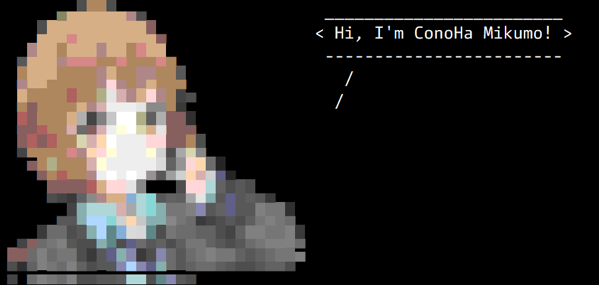
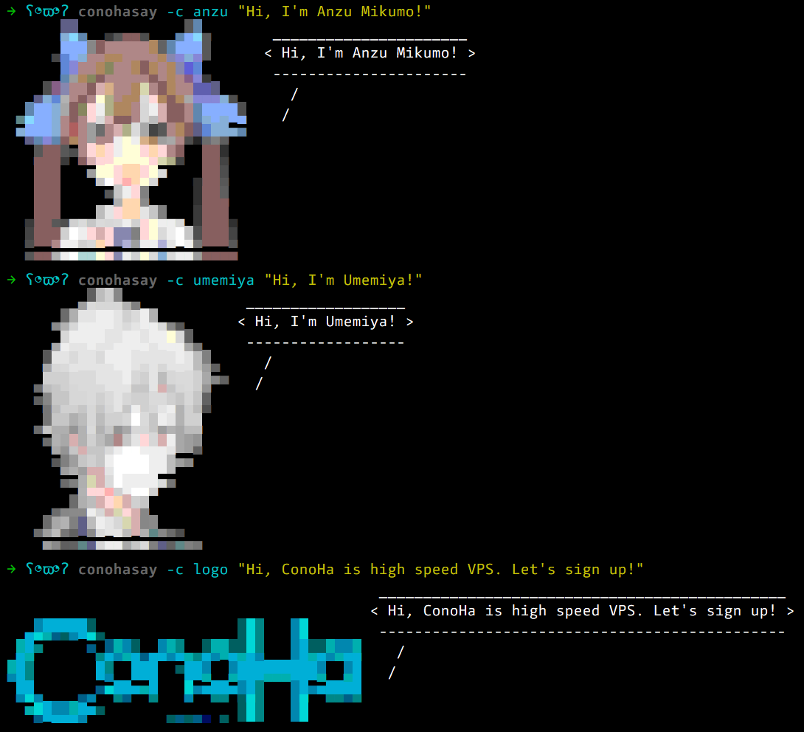
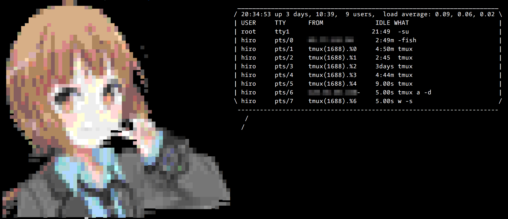

# conohasay

[](LICENSE) [](https://travis-ci.org/hironobu-s/conohasay) [](https://codebeat.co/projects/github-com-hironobu-s-conohasay)


**conohasay** は[cowsay](https://en.wikipedia.org/wiki/Cowsay)ライクなCLIツールです。ターミナル上で[ConoHa](https://www.conoha.jp/)のキャラクターが楽しくおしゃべりしますよ。


## 動作環境

動作環境はmacOSおよびLinux系OSです(Windowsは動作しません)。**ターミナルが256色表示をサポートしている必要があります。**


## インストール

以下の手順で実行ファイルをダウンロードしてください。以下のコマンドはカレントディレクトリにダウンロードしますが、使用頻度が高い場合はパスの通った場所に置いてください。

### macOS

```bash
curl -sL https://github.com/hironobu-s/conohasay/releases/download/current/conohasay-osx.amd64.gz | zcat > conohasay && chmod +x ./conohasay
./conohasay -h
```

### Linux(amd64)

```bash
curl -sL https://github.com/hironobu-s/conohasay/releases/download/current/conohasay-linux.amd64.gz | zcat > conohasay && chmod +x ./conohasay
./conohasay -h
```
### Docker

Dockerがインストールされているなら、下記コマンドですぐに試すことができます。

```bash
docker run -i hironobu/conohasay -h
```

## 使い方

引数を渡すと、その文字列を表示します(標準入力から渡すこともできます)

```shell
conohasay "I'm ConoHa Mikumo!"
```




``-c`` オプションでキャラクターを変更できます。


```shell
conohasay -c anzu
```




``-l`` オプションで``-c``オプションに指定できる値の一覧が取得できます。

```shell
# conohasay -l
anzu
conoha
logo
umemiya
```

``-s`` オプションでキャラクターのサイズを変更できます。指定できる値は``s``, ``m``, ``l``のどれかです。

```shell
conohasay -c logo -s l
```

その他のオプションは下記です。

* ``-W`` (wrapcolumn)吹き出しメッセージの幅を指定します。cowsayの同名オプションと同じ機能です。
* ``-f`` (force-vertical-layout)キャラクターと吹き出しメッセージを縦に並べることを強制します。(デフォルトは端末の幅に応じて自動調整されます)。

* ``-v`` バージョンを表示します
* ``-h`` ヘルプを表示します

## 活用例

fortuneコマンドの出力を渡すのがcowsayの定番ですが、**hostname**や**w**や**uptime**などコマンド出力を渡すのも面白いです。

```shell
w -s | conohasay -c conoha -s m
```




## ライセンス

MIT
